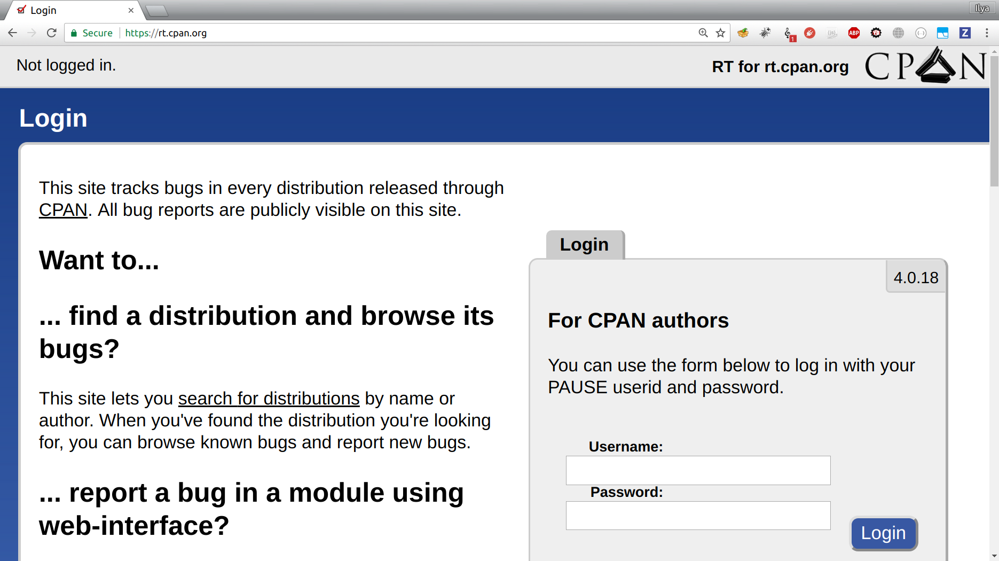
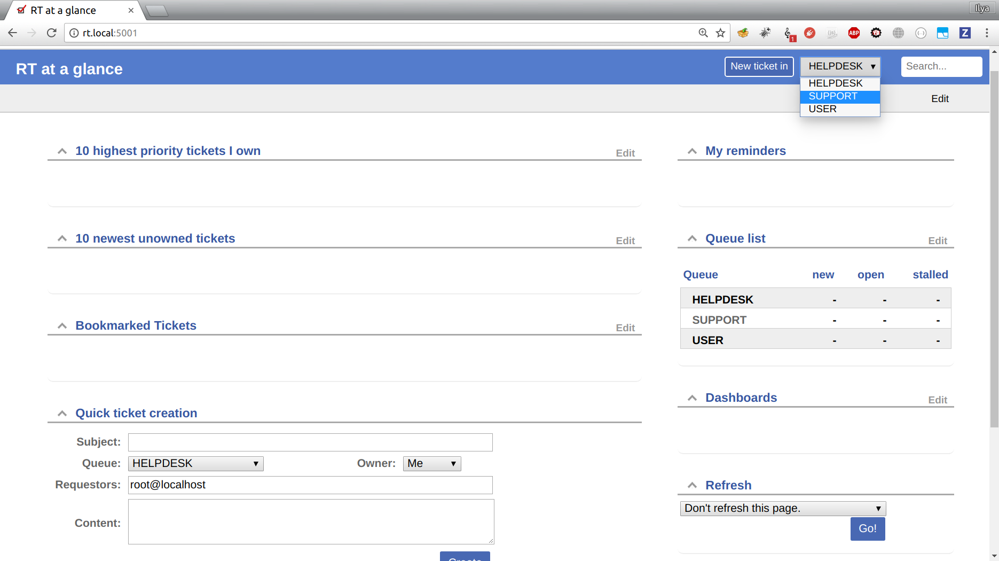
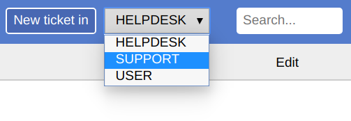
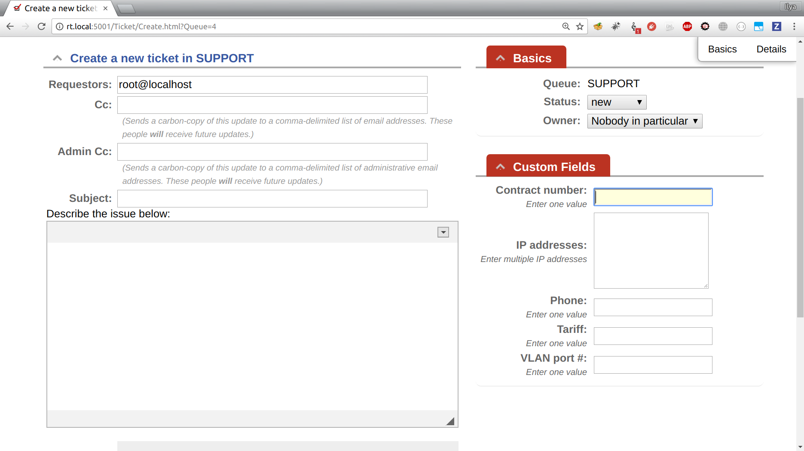
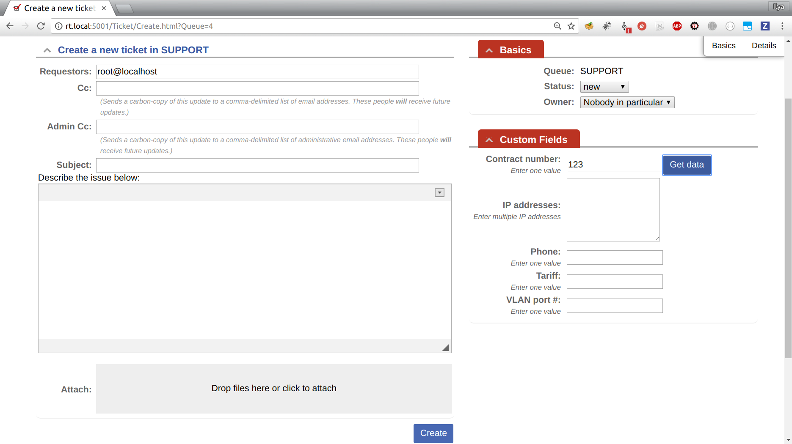
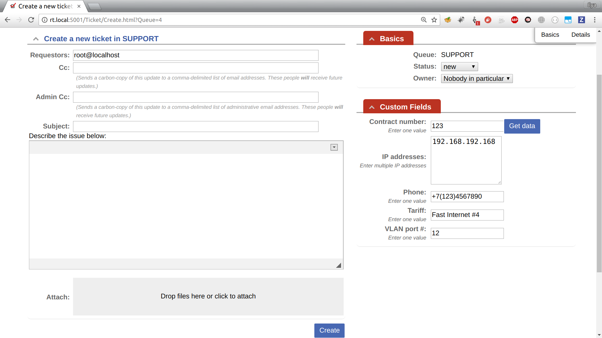
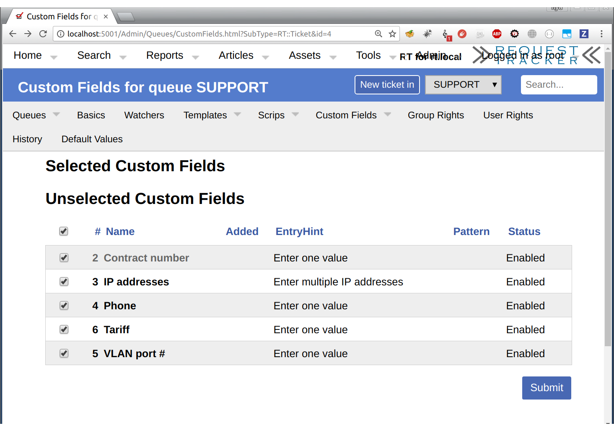
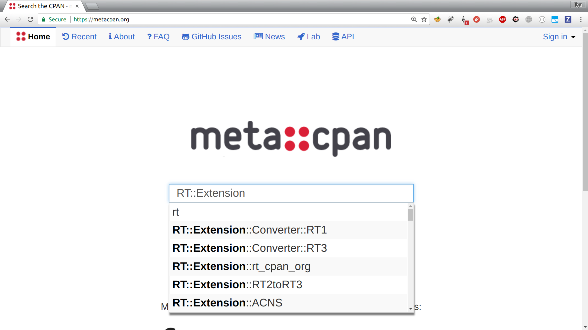
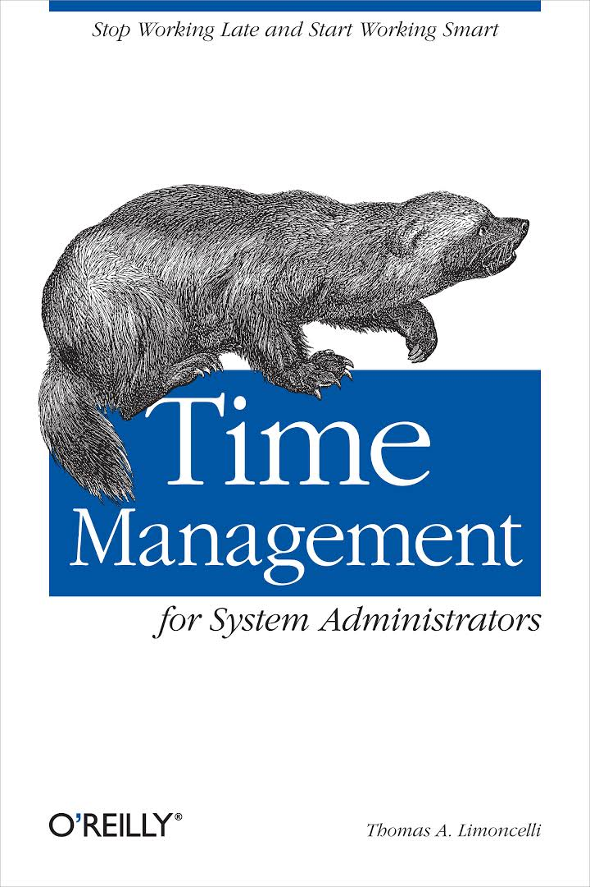

## Developing RT plugin for fun and profit
## (mostly for profit) <!-- .element: class="fragment" data-fragment-index="1" -->

---

## Imagine you're at ISP's call center

---


---

## A user having a problem
## calls us...

Note:
The first thing they ask is...

---

## Contract number

---

## Name, surname, address, phone number...

---

## ...Switch port number, VLAN port, bandwith, tariff, etc, etc...

---

## All of this exists in *other* databases

---

## But is still needed to create and fill a ticket 

Note:
Lots of information.
---


---

## Devs for the rescue!

---

## What is a Ticket?

Note:
Ticket in some trouble ticket software, like RT.
---

## RT

Note:
What is that RT thing at all?
---

## Open-source request tracking system

---

https://bestpractical.com/rt/

Note:
Best Practical Solutions, LLC is the company who developed and provides commercial support for it.
---

## What's so good about it?
---

## Free for any use

---

## Written in Perl

---

## Many organizations use it

Note:
Are they the organizations we care about?
---

## And the Perl ecosystem itself



---

## Tickets
---

## Queues

---
## Custom Fields

Note:
*Ticket* can be created in a *Queue*. Each *Queue* can have its own set of associated *CFs*. Custom fields can be created on their own.

---

---

---


---


---


---

## How to add such a button?

Note:
Let's look under the hood
---

## RT is built with HTML::Mason

---
## The key concept in Mason is "component"

Note:
A component is a mix of HTML, Perl, and special Mason commands, one component per file.
Mason is such a PHP, but you can write Perl inside of it ;)
---

```pre
./Ticket/Graphs:
dhandler Elements index.html

./Ticket/Graphs/Elements:
EditGraphProperties ShowGraph ShowLegends

./User/Elements:
Portlets TicketList UserInfo

./User/Elements/Portlets:
ActiveTickets CreateTicket ExtraInfo InactiveTickets
```

Note:
If we look at source code of these components, we'll find a place where each custom field is generated.
---

## We can edit it and add the "Get data" button where we need!

Note:
That was the first thing I did!
---

## Can't we?

---

## Yes, but...

---

## We'll have problems with shipping

Note:
You can't simply ...
---

## What we can do?

---

## Callbacks

Note:
There is a lot of callbacks inside of RT code.
---
## Component we need


```pre
# Elements/EditCustomFields

$m->callback(
    CallbackName => 'AfterCustomFieldValue',
    CustomField  => $CustomField,
    ...
);
```

---


## Path to Callback

`local/`<br>
`html/Callbacks/`<br>
`<anything>/`<br>
`<path-to-component>/<ClbckName>`

---

## "Get data" button

```pre
# .../Elements/EditCustomFields/AfterCustomFieldValue

% my $config = RTx::FillTicketData::config();
% if ($CustomField
%   && $config
%   && $config->{key_fields}->{ $CustomField->Id } ) {
    <td class="entry">
      <button class="autofill_custom_fields">
        <% loc('Get data') %>
      </button>
    </td>
% }
```

---

## And what's the best way to ship it?

---

## Create a plugin!

---
## But what name to give it?

---
`RT::Extension::$Thing`

---

or

---

`RTx::$Thing`

---

`RTx::FillTicketData`

---
## Path for Callback from Plugin

`local/plugins/<plugin-name>/`<br>
`html/Callbacks/`<br>
`<plugin-name>/`<br>
`<path-to-component>/<ClbckName>`

---

## Button added

---

## What our button is going to do?

---

## Run some JavaScript code

---

## And what that JavaScript is for?

---

## Queries the existing Custom Fields on this page...

---

```
<input name="Object-RT::Ticket--CustomField-2-Values-Magic">
<input name="Object-RT::Ticket--CustomField-3-Values-Magic">
...
<input name="Object-RT::Ticket--CustomField-99-Values-Magic">
```

Note:
So we can essentially gather these fields' values and send them to the backend, identifying the "Key" one

---

## ...and sends them to the *API endpoint*...

---


## But how to load JavaScript on the page?

Note:
No, not via a callback.
Page needs to know which additional JavaScript files to load.
---

```pre
# in lib/RTx/FillTicketData.pm:

# Add plugin-related JavaScript:
RT->AddJavaScript('RTx-FillTicketData.js');

# Can also add CSS:
# RT->AddStyleSheets('...');
```

---

## But we still need API endpoint, don't we?

---

```
# .../html/Helpers/GetTicketData

<%perl>
    $m->out(
        RT::Interface::Web::EncodeJSON(
            RTx::FillTicketData::get_data({ %ARGS })
        )
    );
    $m->abort;
</%perl>
```


Note:
`.../local/plugins/<plugin-name>...`
---

## But how does the backend know where to get data from?

Note:
We need a configuration for our plugin to:
* Identify key fields
* Specify data sources

I've chosen JSON as a configuration format.

---

## Configuration

---
## Configuration: key fields

```javascript

"key_fields": {
    "1": "__CONTRACT_ID__",
},
```

Note:
These are the fields after which the button gets added.
---



---

## Configuration: databases

```javascript

"databases": {
    "users": {
        "database": "users",
        "type":     "mysql",
        "host":     "localhost",
        "port":     "3306",
        "username": "mysql_user",
        "password": "mysql_password_123"
    }
}
```

---

## SQL query

```javascript

"field_sources": {
    "2": [
        {
            "database": "users",
            "sql" : "SELECT ip FROM ip_address
                    WHERE account_id = __CONTRACT_ID__"
        }
    ]
}
```

---

## Command output

```javascript

"3": [
    {
        "command": "/bin/echo 'Hello, __CONTRACT_ID__!'"
    }
]
```

---

## Compound

```javascript

{
    "Body": [
        { "command": "/bin/cat /home/rt/__CONTRACT_ID__" },
        { "Text": "Sincerely yours," }
    ],
    "Subject": [
        { "command": "/bin/get_subject __CONTRACT_ID__" }
    ]
}
```

---

## But how to load that configuration?

---


## Can we hardcode a path to the JSON file?

---

```
# ...path-to-rt/etc/RT_SiteConfig.pm

Set(
    $FillTicketDataSettingsFile =>
    '/home/ichesnokov/rt/etc/fill_ticket_data_settings.json'
);
```

---

```pre
# .../lib/RTx/FillTicketData.pm

sub find_config_file {
    RT->Config->Get('FillTicketDataSettingsFile');
}

```
Note:
Exploring internals of RT module itself can be really useful.
---

## What we have

* *Get data* button callback
* *JavaScript* it invokes
* *API endpoint* component
* *Configuration file*
---

## Proceed to packaging?

---

## RT plugins can be CPAN distributions

Note:
* Can have custom *modules* / *scripts* / *components* / *static files*
* Distributed similar to other Perl modules
    * Module::Install + Module::Install::RTx

---

### Makefile.PL

```pre
use inc::Module::Install;

# Define module name and directories to install
RTx 'RTx-FillTicketData'; # Module::Install::RTx
requires_rt('4.0.0');

# Abstract, author, version, license, Perl version
all_from('lib/RTx/FillTicketData.pm');
no_index 'etc';

# Write out META.yml and Makefile
WriteAll();
```

---


## Installation

```pre
perl Makefile.PL RTHOME=/opt/rt4
make
make test
make install
```

---

## Switching it on

```
# ...path-to-rt/etc/RT_SiteConfig.pm

Plugin('RTx::FillTicketData');
```

---

## What we achieved?

---

## Brief overview of RT concepts

---

## Built a simple plugin

---

## Made call center specialists happier!

---


Note:
Bingo!

---
## Sources of information

* https://bestpractical.com/resources/ - links to various resources including *perldoc for RT*, *forum*, *blog*, *wiki*, and *user guides*.

---
## RT source code

---
https://github.com/bestpractical/rt
---

## Plugins source code

---



---
https://metacpan.org/pod/RTx::FillTicketData

---

# Questions?

---



---

# Thank you!

